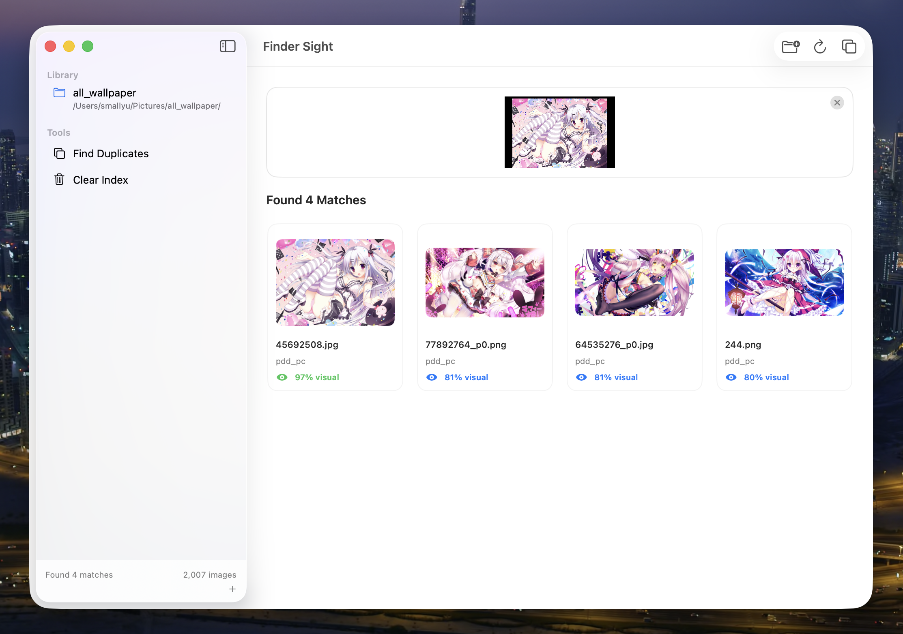
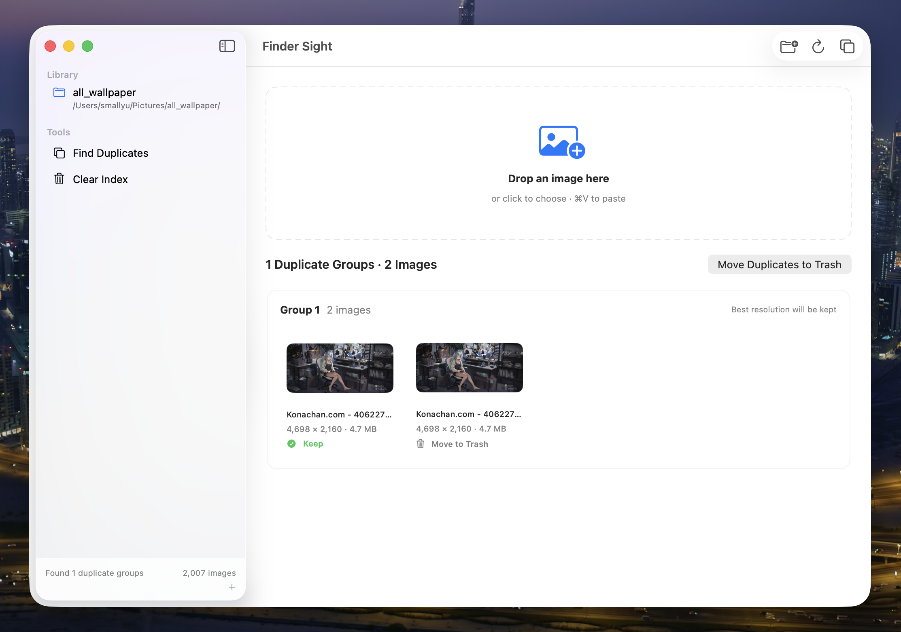

# Finder Sight

[](https://github.com/smallyunet/finder-sight/actions/workflows/ci.yml)
[](https://github.com/smallyunet/finder-sight/actions/workflows/codeql.yml)
[](https://scorecard.dev/viewer/?uri=github.com/smallyunet/finder-sight)
[](LICENSE)

A native macOS app for finding local images with another image. Finder Sight indexes
perceptual hashes and on-device Apple Vision features, then searches without uploading anything.

## Screenshots

### Visual similarity search

<p align="center">
  
</p>

### Duplicate detection

<p align="center">
  
</p>

## Features

- Native SwiftUI and AppKit interface
- Drag, choose, or paste an image to search
- Hybrid perceptual-hash and Apple Vision similarity search
- Border-aware full-image and regional visual matching
- Finder reveal and native context menus
- Dedicated Search and Duplicates workspaces with clear navigation
- Exact duplicate groups with selectable keepers and storage-recovery estimates
- Clear separation between true matches and closest fallback results
- Keyboard-accessible result cards with folder and duplicate-quality details
- Cancellable indexing with skipped-file reporting
- Asynchronous, memory-bounded thumbnail loading
- Dark Mode, macOS accent colors, keyboard shortcuts, and Settings scene
- Fully local processing

## Requirements

- macOS 13 Ventura or later
- Swift 6 toolchain for development

The release app is self-contained and does not require Python or third-party frameworks.

## Privacy and security

- Image indexing, feature extraction, similarity search, and duplicate detection run locally.
- Images, image features, file paths, and search results are never uploaded.
- Finder Sight has no accounts, analytics, telemetry, advertising, hosted backend, login item, or background service.
- The only network request is an optional, user-initiated update check against the public GitHub Releases API.
- The native app has no third-party Swift package dependencies.

See [PRIVACY.md](PRIVACY.md) for the complete data and network behavior and
[SECURITY.md](SECURITY.md) for vulnerability reporting and release verification.

## Development

```bash
# Run focused core tests
make test

# Run the app from source
make run

# Build a native app bundle
make build

# Build the release DMG
make dmg
```

Standard XCTest coverage is also available through `swift test` on a stable Xcode toolchain.

## Keyboard shortcuts

- `⌘O`: Add an image folder
- `⌘I`: Update the index
- `⌘D`: Find duplicates
- `⌘V`: Search the clipboard image
- `⌘1`: Open the Search workspace
- `⌘2`: Open the Duplicates workspace
- `⌘,`: Open Settings

## Data and migration

Finder Sight stores configuration and its native index in:

```text
~/Library/Application Support/FinderSight/
```

Finder Sight preserves folder and search settings across upgrades. Versions that change the
local feature format automatically rebuild the image index without modifying original files.

## Release

Pushing a `v*` tag runs tests, builds the native `.app`, creates `FinderSight-macOS.dmg`,
generates a SHA-256 checksum and GitHub build-provenance attestation, and attaches the DMG
and checksum to a GitHub Release. If the repository has a `VT_API_KEY` Actions secret, the
release workflow also submits the DMG to VirusTotal and adds the public report to the release notes.

Verify a downloaded release:

```bash
shasum -a 256 -c FinderSight-macOS.dmg.sha256
gh attestation verify FinderSight-macOS.dmg -R smallyunet/finder-sight
```

Finder Sight is currently ad-hoc signed, not signed with an Apple Developer ID, and not notarized.
macOS may therefore show an unidentified-developer warning. Security scans and provenance make the
public build auditable, but they do not replace Apple code signing or notarization.

## License

MIT
